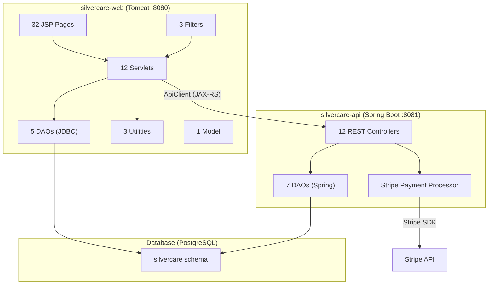
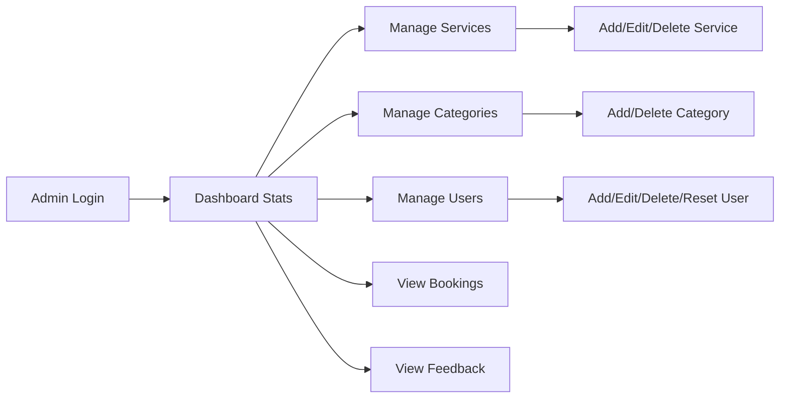

# SilverCare — Complete Project Summary

> Elderly care services web platform built with **Jakarta Servlet/JSP (Tomcat)** + **Spring Boot REST API** + **PostgreSQL** + **Stripe Payments**

---

## Architecture Overview

---

## 1. JSP Pages & Buttons

### 1.1 Public Pages

#### [home.jsp](file:///c:/Users/Aslam/eclipse-workspace/silvercare-web/src/main/webapp/FrontEnd/home.jsp)
| Button / Link | Action |
|---|---|
| **Browse Services** | → `ServiceServlet?action=category` |
| **Category Cards** (top 3) | → `ServiceServlet?action=category` |
| **Login** (navbar) | → `/login` |
| **Register** (navbar) | → `/register` |
| **Cart** icon (navbar) | → `CartServlet?action=view` |
| **Tutorial Overlay** (first-time users) | Step-through tutorial, completes via `UserServlet?action=completeTutorial` |
| **Replay Tutorial** link | → `/home?showTutorial=true` |

#### [about.jsp](file:///c:/Users/Aslam/eclipse-workspace/silvercare-web/src/main/webapp/FrontEnd/about.jsp)
| Button / Link | Action |
|---|---|
| Static informational page | No interactive buttons |

#### [contact.jsp](file:///c:/Users/Aslam/eclipse-workspace/silvercare-web/src/main/webapp/FrontEnd/contact.jsp)
| Button / Link | Action |
|---|---|
| **Send Message** button | POST → `ContactServlet` (saves name, email, subject, message) |

#### [contactSuccess.jsp](file:///c:/Users/Aslam/eclipse-workspace/silvercare-web/src/main/webapp/FrontEnd/contactSuccess.jsp)
| Button / Link | Action |
|---|---|
| **Back to Home** | → `/home` |

#### [login.jsp](file:///c:/Users/Aslam/eclipse-workspace/silvercare-web/src/main/webapp/FrontEnd/login.jsp)
| Button / Link | Action |
|---|---|
| **Login** button | POST → `/login` (email + password) |
| **Register** link | → `/register` |

#### [register.jsp](file:///c:/Users/Aslam/eclipse-workspace/silvercare-web/src/main/webapp/FrontEnd/register.jsp)
| Button / Link | Action |
|---|---|
| **Register** button | POST → `UserServlet?action=register` (email, password, fullName, phone, address) |
| **Login** link | → `/login` |

---

### 1.2 Service Browsing Pages

#### [serviceCategory.jsp](file:///c:/Users/Aslam/eclipse-workspace/silvercare-web/src/main/webapp/FrontEnd/serviceCategory.jsp)
| Button / Link | Action |
|---|---|
| **View Details** (per service card) | → `ServiceServlet?action=details&id={id}` |
| **Add to Cart** (per service) | → `CartServlet?action=add&id={id}` |
| **Search** (search bar) | → `ServiceServlet?action=category&search={term}` |

#### [serviceDetails.jsp](file:///c:/Users/Aslam/eclipse-workspace/silvercare-web/src/main/webapp/FrontEnd/serviceDetails.jsp)
| Button / Link | Action |
|---|---|
| **Add to Cart** | → `CartServlet?action=add&id={id}` |
| **Book Now** | → `BookingServlet?action=form&service_id={id}` |
| **Back to Services** | → `ServiceServlet?action=category` |

#### [services.jsp](file:///c:/Users/Aslam/eclipse-workspace/silvercare-web/src/main/webapp/FrontEnd/services.jsp)
| Button / Link | Action |
|---|---|
| **Search Services** | Filter/display services |

---

### 1.3 Cart & Checkout Pages

#### [cart.jsp](file:///c:/Users/Aslam/eclipse-workspace/silvercare-web/src/main/webapp/FrontEnd/cart.jsp)
| Button / Link | Action |
|---|---|
| **Remove** (per item) | → `CartServlet?action=remove&id={id}` |
| **Proceed to Checkout** | → `BookingServlet?action=form` (cart checkout) |
| **Continue Shopping** | → `ServiceServlet?action=category` |

#### [bookingForm.jsp](file:///c:/Users/Aslam/eclipse-workspace/silvercare-web/src/main/webapp/FrontEnd/bookingForm.jsp)
| Button / Link | Action |
|---|---|
| **Proceed to Payment** | → `checkout.jsp` with booking form data |
| **Back to Cart** | → `CartServlet?action=view` |
| Fields: bookingDate, bookingTime, duration, frequency, contactName, contactPhone, serviceAddress, notes | |

#### [checkout.jsp](file:///c:/Users/Aslam/eclipse-workspace/silvercare-web/src/main/webapp/FrontEnd/checkout.jsp)
| Button / Link | Action |
|---|---|
| **Pay with Card** (Stripe Elements) | JS: creates PaymentIntent via `BookingServlet?action=createPaymentIntent`, then confirms payment with Stripe.js |
| **Confirm Booking** | POST → `BookingServlet?action=save` with paymentIntentId |

#### [bookingSuccess.jsp](file:///c:/Users/Aslam/eclipse-workspace/silvercare-web/src/main/webapp/FrontEnd/bookingSuccess.jsp)
| Button / Link | Action |
|---|---|
| **View My Bookings** | → `BookingServlet?action=list` |
| **Back to Home** | → `/home` |

---

### 1.4 User Account Pages

#### [dashboard.jsp](file:///c:/Users/Aslam/eclipse-workspace/silvercare-web/src/main/webapp/FrontEnd/dashboard.jsp)
| Button / Link | Action |
|---|---|
| **My Bookings** | → `BookingServlet?action=list` |
| **My Profile** | → `/profile` |
| **Browse Services** | → `ServiceServlet?action=category` |

#### [profile.jsp](file:///c:/Users/Aslam/eclipse-workspace/silvercare-web/src/main/webapp/FrontEnd/profile.jsp)
| Button / Link | Action |
|---|---|
| **Update Profile** button | POST → `UserServlet?action=update` (fullName, phone, address) |
| **Change Password** button | POST → `UserServlet?action=update` (currentPassword, newPassword, confirmPassword) |
| **Delete Account** button | POST → `UserServlet?action=deleteAccount` |
| **Replay Tutorial** | → `/home?showTutorial=true` |
| **Logout** | → `UserServlet?action=logout` |

#### [bookings.jsp](file:///c:/Users/Aslam/eclipse-workspace/silvercare-web/src/main/webapp/FrontEnd/bookings.jsp)
| Button / Link | Action |
|---|---|
| **View Details** (per booking) | → `BookingServlet?action=details&id={id}` |

#### [bookingDetails.jsp](file:///c:/Users/Aslam/eclipse-workspace/silvercare-web/src/main/webapp/FrontEnd/bookingDetails.jsp)
| Button / Link | Action |
|---|---|
| **Leave Feedback** | → `FeedbackServlet?action=form&service_id={id}&booking_id={id}` |
| **Back to Bookings** | → `BookingServlet?action=list` |

#### [feedbackForm.jsp](file:///c:/Users/Aslam/eclipse-workspace/silvercare-web/src/main/webapp/FrontEnd/feedbackForm.jsp)
| Button / Link | Action |
|---|---|
| **Submit Feedback** | POST → `FeedbackServlet?action=save` (rating, comment, serviceId, bookingId) |
| **Star Rating** (1-5 stars) | Set rating value |
| **Cancel** | → `BookingServlet?action=details&id={id}` |

#### [feedbackSuccess.jsp](file:///c:/Users/Aslam/eclipse-workspace/silvercare-web/src/main/webapp/FrontEnd/feedbackSuccess.jsp)
| Button / Link | Action |
|---|---|
| **Back to Bookings** | → `BookingServlet?action=list` |

---

### 1.5 Admin Pages

#### [dashboard.jsp (admin)](file:///c:/Users/Aslam/eclipse-workspace/silvercare-web/src/main/webapp/FrontEnd/admin/dashboard.jsp)
| Button / Link | Action |
|---|---|
| **Manage Services** | → `/admin/dashboard?page=manageServices` |
| **Manage Categories** | → `/admin/dashboard?page=manageServiceCategories` |
| **Manage Users** | → `/admin/dashboard?page=manageUsers` |
| **View Bookings** | → `/admin/dashboard?page=viewBookings` |
| **View Feedback** | → `/admin/dashboard?page=viewFeedback` |
| Stats cards: Total Services, Bookings, Revenue, Users | Loaded from `BookingDAO.getDashboardStats()` |

#### [manageServices.jsp (admin)](file:///c:/Users/Aslam/eclipse-workspace/silvercare-web/src/main/webapp/FrontEnd/admin/manageServices.jsp)
| Button / Link | Action |
|---|---|
| **Add New Service** | → `/admin/dashboard?page=addService` |
| **Edit** (per service) | → `/admin/dashboard?page=editService&id={id}` |
| **Delete** (per service) | POST → `/admin/dashboard?action=deleteService&id={id}` |

#### [addService.jsp (admin)](file:///c:/Users/Aslam/eclipse-workspace/silvercare-web/src/main/webapp/FrontEnd/admin/addService.jsp)
| Button / Link | Action |
|---|---|
| **Save Service** | POST → `/admin/dashboard?action=saveService` (name, description, price, categoryId, image upload) |
| **Cancel** | → `/admin/dashboard?page=manageServices` |

#### [editService.jsp (admin)](file:///c:/Users/Aslam/eclipse-workspace/silvercare-web/src/main/webapp/FrontEnd/admin/editService.jsp)
| Button / Link | Action |
|---|---|
| **Update Service** | POST → `/admin/dashboard?action=saveService` (with serviceId for update) |
| **Cancel** | → `/admin/dashboard?page=manageServices` |

#### [manageServiceCategories.jsp (admin)](file:///c:/Users/Aslam/eclipse-workspace/silvercare-web/src/main/webapp/FrontEnd/admin/manageServiceCategories.jsp)
| Button / Link | Action |
|---|---|
| **Add Category** | POST → `/admin/dashboard?action=saveCategory` (name, description, icon) |
| **Delete** (per category) | POST → `/admin/dashboard?action=deleteCategory&id={id}` |

#### [manageUsers.jsp (admin)](file:///c:/Users/Aslam/eclipse-workspace/silvercare-web/src/main/webapp/FrontEnd/admin/manageUsers.jsp)
| Button / Link | Action |
|---|---|
| **Add User** | → `/admin/dashboard?page=addUser` |
| **Edit** (per user) | → `/admin/dashboard?page=editUser&id={id}` |
| **Delete** (per user) | POST → `/admin/dashboard?action=deleteUser&id={id}` |
| **View Details** (JSON) | GET → `/admin/dashboard?action=getUserDetailsJson&id={id}` |

#### [addUser.jsp (admin)](file:///c:/Users/Aslam/eclipse-workspace/silvercare-web/src/main/webapp/FrontEnd/admin/addUser.jsp)
| Button / Link | Action |
|---|---|
| **Create User** | POST → `/admin/dashboard?action=saveUser` |

#### [editUser.jsp (admin)](file:///c:/Users/Aslam/eclipse-workspace/silvercare-web/src/main/webapp/FrontEnd/admin/editUser.jsp)
| Button / Link | Action |
|---|---|
| **Update User** | POST → `/admin/dashboard?action=saveUser` (with userId for update) |
| **Reset Password** | POST → `/admin/dashboard?action=resetPassword&id={id}` |

#### [viewBookings.jsp (admin)](file:///c:/Users/Aslam/eclipse-workspace/silvercare-web/src/main/webapp/FrontEnd/admin/viewBookings.jsp)
| Button / Link | Action |
|---|---|
| **View Details** (per booking) | → `/admin/dashboard?page=bookingDetails&id={id}` |

#### [bookingDetails.jsp (admin)](file:///c:/Users/Aslam/eclipse-workspace/silvercare-web/src/main/webapp/FrontEnd/admin/bookingDetails.jsp)
| Button / Link | Action |
|---|---|
| **Back to Bookings** | → `/admin/dashboard?page=viewBookings` |

#### [viewFeedback.jsp (admin)](file:///c:/Users/Aslam/eclipse-workspace/silvercare-web/src/main/webapp/FrontEnd/admin/viewFeedback.jsp)
| Button / Link | Action |
|---|---|
| Displays all feedback (read-only) | No action buttons |

### 1.6 Shared Components

#### [header.jsp](file:///c:/Users/Aslam/eclipse-workspace/silvercare-web/src/main/webapp/FrontEnd/header.jsp)
| Button / Link | Action |
|---|---|
| **SilverCare** brand | → `/home` |
| **Home** | → `/home` |
| **Services** | → `ServiceServlet?action=category` |
| **About** | → `/about` |
| **Contact** | → `ContactServlet` |
| **Cart** (with badge count) | → `CartServlet?action=view` |
| **Login** (if not logged in) | → `/login` |
| **Register** (if not logged in) | → `/register` |
| **Profile** (if logged in) | → `/profile` |
| **Logout** (if logged in) | → `UserServlet?action=logout` |
| **Admin Dashboard** (admin only) | → `/admin/dashboard` |

#### [footer.jsp](file:///c:/Users/Aslam/eclipse-workspace/silvercare-web/src/main/webapp/FrontEnd/footer.jsp)
| Element | Detail |
|---|---|
| Copyright, social links | Static content |

---

## 2. Servlets (silvercare-web)

### 2.1 [HomeServlet](file:///c:/Users/Aslam/eclipse-workspace/silvercare-web/src/main/java/com/silvercare/servlet/HomeServlet.java) — `@WebServlet({"/home", ""})`

| Method | Action | Description |
|---|---|---|
| `doGet()` | — | Checks tutorial status, loads top 3 categories via `ServiceDAO`, forwards to `home.jsp` |
| `doPost()` | — | Delegates to `doGet()` |

---

### 2.2 [LoginServlet](file:///c:/Users/Aslam/eclipse-workspace/silvercare-web/src/main/java/com/silvercare/servlet/LoginServlet.java) — `@WebServlet("/login")`

| Method | Action | Description |
|---|---|---|
| `doGet()` | — | Forwards to `login.jsp` |
| `doPost()` | — | Authenticates via `UserDAO.authenticate()`, creates session, redirects admin→`/admin/dashboard`, customer→`/dashboard` |

---

### 2.3 [RegisterServlet](file:///c:/Users/Aslam/eclipse-workspace/silvercare-web/src/main/java/com/silvercare/servlet/RegisterServlet.java) — `@WebServlet("/register")`

| Method | Action | Description |
|---|---|---|
| `doGet()` | — | Forwards to `register.jsp` |
| `doPost()` | — | Delegates to `doGet()` (registration handled by `UserServlet`) |

---

### 2.4 [UserServlet](file:///c:/Users/Aslam/eclipse-workspace/silvercare-web/src/main/java/com/silvercare/servlet/UserServlet.java) — `@WebServlet("/UserServlet")`

| Method | Action Param | Description |
|---|---|---|
| `doPost()` | `register` | Calls `handleRegister()` |
| `doPost()` | `login` | Calls `handleLogin()` |
| `doPost()` | `update` | Calls `handleUpdate()` |
| `doPost()` | `completeTutorial` | Calls `handleCompleteTutorial()` |
| `doPost()` | `deleteAccount` | Calls `handleDeleteAccount()` |
| `doGet()` | `logout` | Calls `handleLogout()` |

**Internal Functions:**

| Function | Description |
|---|---|
| `handleLogin()` | Authenticates via `UserDAO`, sets session attributes (user, role, customer_id/admin_id) |
| `handleRegister()` | Registers via `UserDAO.register()` with duplicate email check, auto-logs in |
| `handleUpdate()` | Updates profile fields (fullName, phone, address, password change) via `UserDAO.updateProfile()` |
| `handleCompleteTutorial()` | Updates `tutorial_completed` via `UserDAO.updateTutorialStatus()` |
| `handleLogout()` | Invalidates session, redirects to `/home` |

---

### 2.5 [ServiceServlet](file:///c:/Users/Aslam/eclipse-workspace/silvercare-web/src/main/java/com/silvercare/servlet/ServiceServlet.java) — `@WebServlet("/ServiceServlet")`

| Method | Action Param | Description |
|---|---|---|
| `doGet()` | `category` (default) | Calls `showServiceCatalog()` |
| `doGet()` | `details` | Calls `showServiceDetails()` |

**Internal Functions:**

| Function | Description |
|---|---|
| `showServiceCatalog()` | Loads all categories + services via `ServiceDAO`, maps services to categories, forwards to `serviceCategory.jsp` |
| `showServiceDetails()` | Loads service by ID via `ServiceDAO.getServiceById()`, forwards to `serviceDetails.jsp` |

---

### 2.6 [CartServlet](file:///c:/Users/Aslam/eclipse-workspace/silvercare-web/src/main/java/com/silvercare/servlet/CartServlet.java) — `@WebServlet("/CartServlet")`

| Method | Action Param | Description |
|---|---|---|
| `doGet()` | `view` (default) | Calls `viewCart()` |
| `doGet()` | `add` | Calls `addToCart()` |
| `doGet()` | `remove` | Calls `removeFromCart()` |

**Internal Functions:**

| Function | Description |
|---|---|
| `viewCart()` | Forwards to `cart.jsp` (cart data is in session) |
| `addToCart()` | Loads service via `ServiceDAO.getServiceById()`, adds to session cart list (prevents duplicates), updates cart_count |
| `removeFromCart()` | Removes item by ID from session cart, updates cart_count |

---

### 2.7 [BookingServlet](file:///c:/Users/Aslam/eclipse-workspace/silvercare-web/src/main/java/com/silvercare/servlet/BookingServlet.java) — `@WebServlet("/BookingServlet")`

| Method | Action Param | Description |
|---|---|---|
| `doGet()` | `form` | Calls `showBookingForm()` |
| `doGet()` | `list` | Calls `listBookings()` |
| `doGet()` | `details` | Calls `showBookingDetails()` |
| `doPost()` | `save` | Calls `saveBooking()` |
| `doPost()` | `createPaymentIntent` | Calls `handleCreatePaymentIntent()` |

**Internal Functions:**

| Function | Description |
|---|---|
| `showBookingForm()` | Loads service or cart data, forwards to `bookingForm.jsp` |
| `listBookings()` | Gets bookings by customer via `BookingDAO.getBookingsByCustomer()`, forwards to `bookings.jsp` |
| `showBookingDetails()` | Gets booking + details via `BookingDAO`, forwards to `bookingDetails.jsp` |
| `saveBooking()` | Creates booking from form data. Handles **both** single service (by `service_id`) and multi-item cart checkout (loops through session cart). Calculates GST (9%), calls `BookingDAO.createBooking()`, clears cart, redirects to `bookingSuccess.jsp` |
| `handleCreatePaymentIntent()` | Calls Spring Boot API `/payment/create-intent` via `ApiClient`, returns JSON with `clientSecret` for Stripe.js |

---

### 2.8 [ProfileServlet](file:///c:/Users/Aslam/eclipse-workspace/silvercare-web/src/main/java/com/silvercare/servlet/ProfileServlet.java) — `@WebServlet("/profile")`

| Method | Action | Description |
|---|---|---|
| `doGet()` | — | Checks login, forwards to `profile.jsp` |

---

### 2.9 [ContactServlet](file:///c:/Users/Aslam/eclipse-workspace/silvercare-web/src/main/java/com/silvercare/servlet/ContactServlet.java) — `@WebServlet("/ContactServlet")`

| Method | Action | Description |
|---|---|---|
| `doGet()` | — | Forwards to `contact.jsp` |
| `doPost()` | — | Saves contact message via `ContactDAO.saveContact()`, redirects to success |

---

### 2.10 [AboutServlet](file:///c:/Users/Aslam/eclipse-workspace/silvercare-web/src/main/java/com/silvercare/servlet/AboutServlet.java) — `@WebServlet("/about")`

| Method | Action | Description |
|---|---|---|
| `doGet()` | — | Forwards to `about.jsp` |

---

### 2.11 [FeedbackServlet](file:///c:/Users/Aslam/eclipse-workspace/silvercare-web/src/main/java/com/silvercare/servlet/FeedbackServlet.java) — `@WebServlet("/FeedbackServlet")`

| Method | Action Param | Description |
|---|---|---|
| `doGet()` | `form` | Shows feedback form (checks ownership via ApiClient) |
| `doPost()` | `save` | Saves feedback via ApiClient POST to `/feedback` |

---

### 2.12 [AdminDashboardServlet](file:///c:/Users/Aslam/eclipse-workspace/silvercare-web/src/main/java/com/silvercare/servlet/AdminDashboardServlet.java) — `@WebServlet("/admin/dashboard")`

| Method | Page/Action Param | Description |
|---|---|---|
| `doGet()` | `page=dashboard` (default) | Loads stats, forwards to admin `dashboard.jsp` |
| `doGet()` | `page=manageServices` | Loads services + categories, forwards to `manageServices.jsp` |
| `doGet()` | `page=addService` | Loads categories, forwards to `addService.jsp` |
| `doGet()` | `page=editService` | Loads service for edit, forwards to `editService.jsp` |
| `doGet()` | `page=manageServiceCategories` | Loads categories, forwards to `manageServiceCategories.jsp` |
| `doGet()` | `page=manageUsers` | Loads users, forwards to `manageUsers.jsp` |
| `doGet()` | `page=addUser` | Forwards to `addUser.jsp` |
| `doGet()` | `page=editUser` | Loads user for edit, forwards to `editUser.jsp` |
| `doGet()` | `page=viewBookings` | Loads bookings, forwards to `viewBookings.jsp` |
| `doGet()` | `page=bookingDetails` | Loads booking details, forwards to `bookingDetails.jsp` |
| `doGet()` | `page=viewFeedback` | Loads feedback, forwards to `viewFeedback.jsp` |
| `doPost()` | `action=saveService` | Creates or updates service (with image upload via `FileService`) |
| `doPost()` | `action=deleteService` | Deletes service via `ServiceDAO.deleteService()` |
| `doPost()` | `action=saveCategory` | Creates category via `ServiceDAO.addCategory()` |
| `doPost()` | `action=deleteCategory` | Deletes category via `ServiceDAO.deleteCategory()` |
| `doPost()` | `action=saveUser` | Creates/updates user via `UserDAO` |
| `doPost()` | `action=deleteUser` | Deletes user via `UserDAO.deleteUser()` |
| `doPost()` | `action=resetPassword` | Resets user password |
| `doGet()` | `action=getUserDetailsJson` | Returns user data as JSON |

---

## 3. Filters (Security)

### 3.1 [SessionManagementFilter](file:///c:/Users/Aslam/eclipse-workspace/silvercare-web/src/main/java/com/silvercare/web/filter/SessionManagementFilter.java) — `@WebFilter("/*")`

| Function | Description |
|---|---|
| `doFilter()` | Routes requests through access control. Public paths pass through. Admin paths delegated to LoginFilter. Protected user paths require `session.user != null` |
| `isPublicPath()` | Returns true for: `/home`, `/about`, `/login`, `/register`, `/ContactServlet`, `/ServiceServlet`, static resources |
| `isProtectedUserPath()` | Returns true for: `/profile`, `/BookingServlet`, `/CartServlet`, `/FeedbackServlet`, `/dashboard`, `/UserServlet` |

### 3.2 [LoginFilter](file:///c:/Users/Aslam/eclipse-workspace/silvercare-web/src/main/java/com/silvercare/web/filter/LoginFilter.java) — Filters `/admin/*`

| Function | Description |
|---|---|
| `doFilter()` | Checks `session.admin_id` exists. Redirects to `/login?error=admin_required` if not admin |

### 3.3 [AdminFilter](file:///c:/Users/Aslam/eclipse-workspace/silvercare-web/src/main/java/com/silvercare/web/AdminFilter.java)

| Function | Description |
|---|---|
| `doFilter()` | Additional admin access validation |

---

## 4. DAOs — silvercare-web (JDBC)

### 4.1 [UserDAO](file:///c:/Users/Aslam/eclipse-workspace/silvercare-web/src/main/java/com/silvercare/dao/UserDAO.java)

| Method | SQL Operation | Description |
|---|---|---|
| `authenticate(email, password)` | SELECT | Finds user by email, verifies BCrypt password hash |
| `register(userData)` | INSERT | Pre-checks duplicate email, hashes password, inserts user, returns user map |
| `getUserById(id)` | SELECT | Returns user data by user_id |
| `getAllUsers()` | SELECT | Returns list of all users (admin management) |
| `updateTutorialStatus(userId, completed)` | UPDATE | Updates `tutorial_completed` flag |
| `updateProfile(userId, profileData)` | UPDATE | Updates fullName, phone, address, password (with BCrypt re-hash) |
| `deleteUser(id)` | DELETE | Removes user by ID |
| `mapResultSetToUser(rs)` | — | Maps ResultSet to user Map |

### 4.2 [ServiceDAO](file:///c:/Users/Aslam/eclipse-workspace/silvercare-web/src/main/java/com/silvercare/dao/ServiceDAO.java)

| Method | SQL Operation | Description |
|---|---|---|
| `getAllServices()` | SELECT + JOIN | Returns all active services with category names |
| `getServiceById(id)` | SELECT + JOIN | Returns single service with category name |
| `getAllCategories()` | SELECT | Returns all service categories (id, name, description, icon) |
| `searchServices(term)` | SELECT + ILIKE | Searches services by name/description pattern |
| `addService(Service)` | INSERT | Adds new service with category, price, image |
| `updateService(Service)` | UPDATE | Updates all service fields |
| `deleteService(id)` | DELETE | Removes service by ID |
| `addCategory(name, desc, icon)` | INSERT | Creates new service category |
| `deleteCategory(id)` | DELETE | Removes category by ID |

### 4.3 [BookingDAO](file:///c:/Users/Aslam/eclipse-workspace/silvercare-web/src/main/java/com/silvercare/dao/BookingDAO.java)

| Method | SQL Operation | Description |
|---|---|---|
| `createBooking(customerId, date, status, total, gst, paymentIntentId, details)` | INSERT (transactional) | Inserts booking + booking_details rows in a single transaction |
| `getBookingsByCustomer(customerId)` | SELECT + JOIN | Returns all bookings for a customer with service names |
| `getBookingById(bookingId)` | SELECT | Returns single booking |
| `getBookingDetails(bookingId)` | SELECT + JOIN | Returns line items for a booking |
| `getMonthlyRevenue()` | SELECT + GROUP BY | Reports monthly revenue for past 6 months |
| `getTopServices()` | SELECT + GROUP BY | Reports top 5 most-booked services |
| `getDashboardStats()` | SELECT + COUNT/SUM | Returns total bookings, revenue, active services, users |

### 4.4 [ContactDAO](file:///c:/Users/Aslam/eclipse-workspace/silvercare-web/src/main/java/com/silvercare/dao/ContactDAO.java)

| Method | SQL Operation | Description |
|---|---|---|
| `saveContact(contactData)` | INSERT | Saves contact message (name, email, subject, message) |

### 4.5 [FeedbackDAO](file:///c:/Users/Aslam/eclipse-workspace/silvercare-web/src/main/java/com/silvercare/dao/FeedbackDAO.java)

| Method | SQL Operation | Description |
|---|---|---|
| `saveFeedback(data)` | INSERT | Saves feedback (customerId, serviceId, rating, comment) |
| `getFeedback(customerId, serviceId)` | SELECT | Gets existing feedback for edit mode |

---

## 5. REST Controllers — silvercare-api (Spring Boot)

### 5.1 [ServicesRestController](file:///c:/Users/Aslam/eclipse-workspace/silvercare-api/src/main/java/com/silvercare/controller/ServicesRestController.java) — `/services`

| Endpoint | Method | Description |
|---|---|---|
| `/services` | GET | List all services |
| `/services/{id}` | GET | Get service by ID |
| `/services` | POST | Create service |
| `/services/{id}` | PUT | Update service |
| `/services/{id}` | DELETE | Delete service |
| `/services/search?term=` | GET | Search services |

### 5.2 [AdminServicesRestController](file:///c:/Users/Aslam/eclipse-workspace/silvercare-api/src/main/java/com/silvercare/controller/AdminServicesRestController.java) — `/admin/services`

| Endpoint | Method | Description |
|---|---|---|
| `/admin/services/categories` | GET | List categories |
| `/admin/services/categories` | POST | Create category |
| `/admin/services/categories/{id}` | DELETE | Delete category |

### 5.3 [BookingRestController](file:///c:/Users/Aslam/eclipse-workspace/silvercare-api/src/main/java/com/silvercare/controller/BookingRestController.java) — `/bookings`

| Endpoint | Method | Description |
|---|---|---|
| `/bookings` | POST | Create booking |
| `/bookings/{id}` | GET | Get booking by ID |
| `/bookings/customer/{customerId}` | GET | Get bookings by customer |

### 5.4 [UserRestController](file:///c:/Users/Aslam/eclipse-workspace/silvercare-api/src/main/java/com/silvercare/controller/UserRestController.java) — `/users`

| Endpoint | Method | Description |
|---|---|---|
| `/users` | GET | List all users |
| `/users/{id}` | GET | Get user by ID |
| `/users/{id}` | PUT | Update user |
| `/users/{id}` | DELETE | Delete user |
| `/users/authenticate` | POST | Authenticate user |

### 5.5 [PaymentRestController](file:///c:/Users/Aslam/eclipse-workspace/silvercare-api/src/main/java/com/silvercare/controller/PaymentRestController.java) — `/payment`

| Endpoint | Method | Description |
|---|---|---|
| `/payment/create-intent` | POST | Create Stripe PaymentIntent (amount, currency, description) → returns clientSecret |
| `/payment/verify/{paymentIntentId}` | GET | Verify payment status |
| `/payment/process` | POST | Simple payment processing (backwards compatibility) |

### 5.6 [WebhookController](file:///c:/Users/Aslam/eclipse-workspace/silvercare-api/src/main/java/com/silvercare/controller/WebhookController.java) — `/webhook`

| Endpoint | Method | Description |
|---|---|---|
| `/webhook/stripe` | POST | Handles Stripe webhook events |

**Internal Event Handlers:**

| Function | Stripe Event | Description |
|---|---|---|
| `handlePaymentSucceeded()` | `payment_intent.succeeded` | Logs payment, returns success |
| `handlePaymentFailed()` | `payment_intent.payment_failed` | Logs failure with error details |
| `handleCheckoutCompleted()` | `checkout.session.completed` | Logs checkout completion |
| `handleChargeRefunded()` | `charge.refunded` | Logs refund event |

### 5.7 [ContactRestController](file:///c:/Users/Aslam/eclipse-workspace/silvercare-api/src/main/java/com/silvercare/controller/ContactRestController.java) — `/contact`

| Endpoint | Method | Description |
|---|---|---|
| `/contact` | POST | Save contact message |

### 5.8 [FeedbackRestController](file:///c:/Users/Aslam/eclipse-workspace/silvercare-api/src/main/java/com/silvercare/controller/FeedbackRestController.java) — `/feedback`

| Endpoint | Method | Description |
|---|---|---|
| `/feedback` | GET | Get feedback by customerId + serviceId |
| `/feedback` | POST | Create/update feedback |
| `/feedback/service/{serviceId}` | GET | Get all feedback for a service |

### 5.9 [AdminDashboardRestController](file:///c:/Users/Aslam/eclipse-workspace/silvercare-api/src/main/java/com/silvercare/controller/AdminDashboardRestController.java) — `/admin/dashboard`

| Endpoint | Method | Description |
|---|---|---|
| `/admin/dashboard/stats` | GET | Dashboard statistics (service/booking/user/revenue counts) |
| `/admin/dashboard/recent-bookings` | GET | Recent bookings list |
| `/admin/dashboard/overview` | GET | Top services + categories overview |

### 5.10 [ReportRestController](file:///c:/Users/Aslam/eclipse-workspace/silvercare-api/src/main/java/com/silvercare/controller/ReportRestController.java) — `/reports`

| Endpoint | Method | Description |
|---|---|---|
| `/reports/monthly-revenue` | GET | Monthly revenue for past 6 months |
| `/reports/top-services` | GET | Top 5 most-booked services |

### 5.11 [AdminReportRestController](file:///c:/Users/Aslam/eclipse-workspace/silvercare-api/src/main/java/com/silvercare/controller/AdminReportRestController.java) — `/admin/reports`

| Endpoint | Method | Description |
|---|---|---|
| `/admin/reports/sales` | GET | Sales report data |

### 5.12 [StatusRestController](file:///c:/Users/Aslam/eclipse-workspace/silvercare-api/src/main/java/com/silvercare/controller/StatusRestController.java) — `/status`

| Endpoint | Method | Description |
|---|---|---|
| `/status` | GET | Health check — returns API status |

---

## 6. Utilities (silvercare-web)

### 6.1 [ApiClient](file:///c:/Users/Aslam/eclipse-workspace/silvercare-web/src/main/java/com/silvercare/util/ApiClient.java)

| Method | Description |
|---|---|
| `get(path, responseType)` | HTTP GET to Spring Boot API, returns `ApiResponse<T>` |
| `post(path, body, responseType)` | HTTP POST to Spring Boot API |
| `put(path, body, responseType)` | HTTP PUT to Spring Boot API |
| `delete(path, responseType)` | HTTP DELETE to Spring Boot API |

### 6.2 [DBConnection](file:///c:/Users/Aslam/eclipse-workspace/silvercare-web/src/main/java/com/silvercare/util/DBConnection.java)

| Method | Description |
|---|---|
| `getConnection()` | Returns PostgreSQL JDBC connection using `DB_URL`, `DB_USER`, `DB_PASSWORD` env vars |

### 6.3 [FileService](file:///c:/Users/Aslam/eclipse-workspace/silvercare-web/src/main/java/com/silvercare/util/FileService.java)

| Method | Description |
|---|---|
| `saveFile(Part, uploadDir)` | Saves uploaded file to server filesystem, returns relative path |

---

## 7. Model

### 7.1 [Service](file:///c:/Users/Aslam/eclipse-workspace/silvercare-web/src/main/java/com/silvercare/model/Service.java)

| Field | Type | Description |
|---|---|---|
| `id` | int | Service ID (PK) |
| `categoryId` | int | FK to service_category |
| `name` | String | Service name |
| `description` | String | Service description |
| `price` | BigDecimal | Service price |
| `imagePath` | String | Path to service image |
| `isActive` | boolean | Active/inactive flag |
| `categoryName` | String | Joined category name (transient) |

---

## 8. Configuration

### 8.1 [CorsConfig](file:///c:/Users/Aslam/eclipse-workspace/silvercare-api/src/main/java/com/silvercare/config/CorsConfig.java)

| Setting | Value |
|---|---|
| Allowed Origins | `http://localhost:8080`, `http://silvercare-web:8080` |
| Allowed Methods | GET, POST, PUT, DELETE, OPTIONS |
| Allowed Headers | `*` |
| Allow Credentials | `true` |

### 8.2 [application.properties](file:///c:/Users/Aslam/eclipse-workspace/silvercare-api/src/main/resources/application.properties)

| Property | Description |
|---|---|
| `server.port` | `8081` |
| `server.servlet.context-path` | `/s-api` |
| `stripe.secret.key` | Stripe API secret key |
| `stripe.publishable.key` | Stripe publishable key |
| `stripe.webhook.secret` | Webhook signing secret |
| `app.client.url` | Client base URL for redirects |
| `spring.datasource.*` | PostgreSQL connection config |

---

## 9. Database Schema

| Table | Description | Key Columns |
|---|---|---|
| `silvercare.user` | Users (customers + admins) | user_id, email, password (BCrypt), fullName, phone, address, role, tutorial_completed |
| `silvercare.service` | Services offered | service_id, category_id, name, description, price, image_path, is_active |
| `silvercare.service_category` | Service categories | category_id, name, description, icon |
| `silvercare.booking` | Booking headers | booking_id, customer_id, booking_date, status, total_amount, gst_amount, payment_intent_id |
| `silvercare.booking_detail` | Booking line items | detail_id, booking_id, service_id, quantity, unit_price, notes |
| `silvercare.feedback` | Customer feedback | feedback_id, customer_id, service_id, rating, comment |
| `silvercare.contact_message` | Contact form submissions | message_id, name, email, subject, message |

---

## 10. Complete User Flow Diagrams

### Customer Journey

```mermaid
flowchart LR
    A[Home] --> B[Browse Services]
    B --> C[Service Details]
    C --> D[Add to Cart]
    D --> E[View Cart]
    E --> F[Booking Form]
    F --> G[Checkout / Stripe Payment]
    G --> H[Booking Success]
    H --> I[View Bookings]
    I --> J[Booking Details]
    J --> K[Leave Feedback]
```

### Admin Journey

---

## 11. File Counts Summary

| Component | Count |
|---|---|
| JSP Pages | **32** |
| Servlets | **12** |
| REST Controllers | **12** |
| Web DAOs (JDBC) | **5** |
| API DAOs (Spring) | **7** |
| Filters | **3** |
| Utilities | **3** |
| Models | **1** |
| Config Classes | **1** |
| **Total Java Files** | **~44** |
| **Total JSP Files** | **32** |
